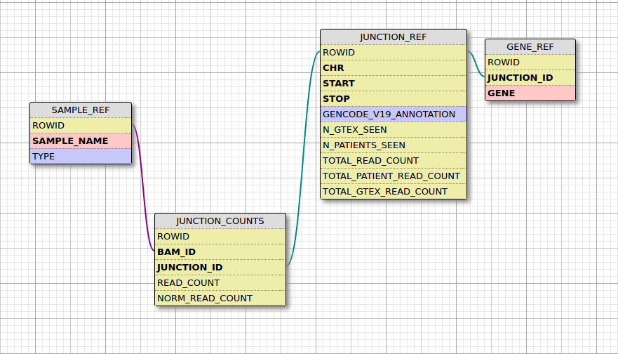

# MendelianRNA-seq-DB



#### Modification of Beryl Cummings scripts for discovering novel splicing events through RNA-seq

MendelianRNA-seq-DB is a tool to discover splice sites in a collection of BAM files. It is a rewrite of [MendelianRNA-seq](https://github.com/dennis-kao/MendelianRNA-seq).

## Pipeline

SpliceJunctionDiscovery.py calls upon samtools to report the presence of introns in a list of regions of interest, summarizes their read counts, and writes this to a text file. AddJunctionsToDatabase.py reads this output, performs gencode annotations and normalization, and stores the information into a database. FilterSpliceJunctions.py contains some pre-defined queries which can be used to filter junctions in hopes of finding an aberrant splicing event causative for disease.

SpliceJunctionDiscovery.py usually takes the longest to execute because it calls upon samtools based on the number of samples * the number of regions of interest. This step is parallelized and the number of worker processes can specified in the torque file or as an arguement to the script. 

AddJunctionsToDatabase.py is much faster and likely takes minutes to an hour for sample sizes less than 100. Querrying the database using FilterSpliceJunctions is probably the fastest step taking seconds to execute.

## Required files

1. .bam (and .bai) files produced from an RNA-seq pipeline - You need a sufficient number of high quality control BAMs so that you can filter out more splice junctions and discover those that are specific to a diseased sample. The [GTEx project](https://www.gtexportal.org/home/) is a good resource for control BAMs. These BAM files should all be from the same tissue due to tissue specific expression. A way to test for contaminated tissue samples has been described in the study cited below. Note that you can generate .bai files from .bam files using this line: ```parallel  samtools index ::: *.bam```

2. transcript_file - A text file containing a list of genes and their spanning chromosome positions that you want to discover junctions in:
	```
	GENE	ENSG	STRAND	CHROM	START	STOP	GENE_TYPE
	```
	You can use [genes.R](https://github.com/naumenko-sa/bioscripts/blob/master/genes.R) for that, or convert an existing .bed file using this bash line:
```
cat kidney.glomerular.genes.bed | awk '{print $4"\t"$4"\t+\t"$1"\t"$2"\t"$3"\tNEXONS"}' >> gene.list
```
3. bamlist.list - A file containing the names of all the bams you want to discover junctions in. The file should quite simply be:
	
	
		G65693.GTEX.8TY6-5R5T.2.bam
		G55612.GTEX.7G54-3GS8.1.bam
		G09321.GTEX.0EYJ-9E12.3.bam
		PATIENT.bam
	
	
	An easy way to generate this file would be to navigate to a directory containing the .bam files you want to use and running this line: ```ls *.bam | grep '' > bamlist.list```

4. transcript_model - A text file containing a list of known canonical splice junctions. These will be used to evaluate a junction's annotation (none, one, both) and it's annotated normalization calculation. You can use your own, or use the [included file](gencode.comprehensive.splice.junctions.txt). This file contains junctions from gencode v19.


## Steps

1. Put bamlist.list, .bam files, .bai files in a new directory. Navigate to it. 
	NOTE: there should not be any .txt files present beforehand in order for SpliceJunctionDiscovery.py to run correctly.

2. For [Torque](http://www.adaptivecomputing.com/products/open-source/torque/) users there is a [PBS file](Analysis/rnaseq.novel_splice_junction_discovery.pbs) containing all the commands you need to run. Just change the "home" directory in the file to match where you placed the MendelianRNA-seq folder and run: 

	```qsub MendelianRNA-seq/Analysis/rnaseq.novel_splice_junction_discovery.pbs -v transcriptFile=transcript_file,bamList=bamlist.list,processes=10```
	
	For non-Torque users, SpliceJunctionDiscovery can be run from terminal:
	
	```python3 MendelianRNA-seq/Analysis/SpliceJunctionDiscovery.py -transcriptFile=$transcriptFile -bamList=$bamList -processes=$processes```
	
	Parameters:
	1. transcriptFile, path to file #2
	2. bamList, path to file #3
	3. processes, the number of worker processes running in the background calling samtools. This the slowest step in the program. This number should be equal to or less than the number of cores on your machine.
	
		For torque users: This number should also be equal to or less than the number specified for ppn in rnaseq.novel_splice_junction_discovery.pbs:

		
			#PBS -l walltime=10:00:00,nodes=1:ppn=10

3. Run AddJunctionsToDatabase.py with --addGencode or --addGencodeWithFlanks to initally populate the database with gencode junctions. 

	```python3 AddJunctionsToDatabase.py --addGencodeWithFlanks -transcript_model=gencode.comprehensive.splice.junctions.txt```
	
4. Run SpliceJunctionDiscovery.py with --addBAM to populate the database with junctions and read counts from your samples.

	```python3 AddJunctionsToDatabase.py --addBAM -gene_list=kidney.glomerular.genes.list -processes=4 -bamlist=bamlist.list```
	
5. Documentation on how to use FilterSpliceJunctions.py will be added later.

## Output

SpliceJunctionDiscovery.py generates a folder for each bam. Within this folder are text files containing summarized read counts for junctions pertaining to a specific gene. You can delete these folders once all the information has been added to the database.

By default the database is named SpliceJunction.db. There are 4 tables:

	1. SAMPLE_REF, a list of samples and their type (0 = GTEX or control, 1 = patient)
	2. JUNCTION_REF, a list of junctions and their frequency of appearances in samples
	3. JUNCTION_COUNTS, read counts of junctions in a sample
	4. GENE_REF, an annotation of junctions with genes, a single junction can map to multiple genes

## Differences between MendelianRNA-seq-DB and Beryl Cumming's original MendelianRNA-seq

- SpliceJunctionDiscovery has been rewritten in Python and parallelized - decreasing processing time by a factor proprotional to the number of worker processes
- CIGAR string parsing is handled by a function called parseCIGARForIntrons() whereas before CIGAR strings were handled by piping through multiple bash tools. As a result of improper parsing using bash tools, junction start and/or stop positions were not reported properly (e.x. 1:100-200*1D30 represents an alignment that should really be 1:100-230 or 1:100-231)
- Junction flanking in NormalizeSpliceJunctionValues.py has been fixed and now works. When flanking junctions were added to the set in the original make_annotated_junction_set(), individual characters in the string were added as opposed to the entire string itself (e.x. 1:100-200 gets added as '1', ':', '0', '2', '-')
- All information produced by SpliceJunctionDiscovery is stored in a database instead of text files. This allows the user to utilize previously computed results instead of having to run the entire pipeline again when a new sample needs to be analyzed.
- The database has some new fields that can be used to filter junctions: 
	```
	n_patients_seen
	n_gtex_seen
	total_read_count
	total_patient_read_count
	total_gtex_read_count
	```
- Junction annotation now discriminates between START and STOP instead of 'ONE'. In addition, there is a new annotation, called 'EXON_SKIP' which denotes the event of exon skipping. This is done by checking the reference transcript_model to see if the start and stop positions belong to different junctions.
- Normalization of annotated junctions now considers read counts from all junctions which have at least one annotated junction as the denominator whereas before only "BOTH" annotated junctions were used
- From the gencode file, multipe junctions are generated from a single junction to increase the definition for what is considered to be "annotated". The start and stop position of each junction both have a +/- 1 tolerance. The different combinations of these values (i.e. junction = start + 1, stop + 1) can be been in the function storeTranscriptModelJunctions() of [AddJunctionsToDatabase.py](Analysis/AddJunctionsToDatabase.py). This likely introduces a larger number of false positives for reported EXON_SKIP events. There is an option to not use flanking at all (--addGencode). 

## Citations

[Improving genetic diagnosis in Mendelian disease with transcriptome sequencing](http://stm.sciencemag.org/content/9/386/eaal5209)

Beryl Cumming's original scripts: [MendelianRNA-seq](https://github.com/berylc/MendelianRNA-seq)

## Footnotes

The included transcript_model file [_gencode.comprehensive.splice.junctions.txt_](https://github.com/dennis-kao/MendelianRNA-seq/blob/master/gencode.comprehensive.splice.junctions.txt) is based off of gencode v19.

A gene can encompass partial or whole regions of other genes. This edge case has been accounted for in AddJunctionsToDatabase.py in two ways: 

	1. The mapping of a single junction to multiple genes has been done with the table GENE_REF
	2. If the script encounters the same junction in a sample more than once, it will utilize the result with the highest read count for read count and normalized read count and will discard the other.
